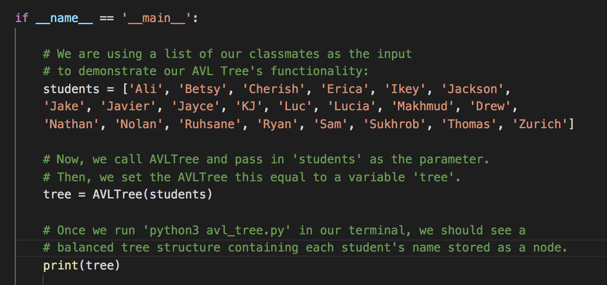
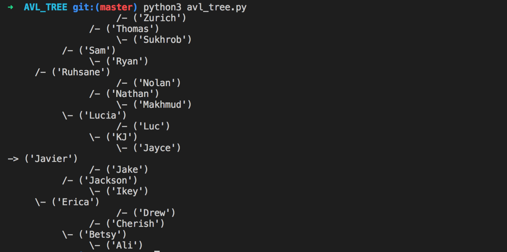

## Implementing an AVL Tree in Python

An AVL Tree is a type of binary search tree (BST) that is able to balance itself. The AVL tree seeks to prevent a BST from its worst-case scenario:

> "In a worst-case scenario, a BST could become unbalanced and function more like a linked list, which is still technically a binary tree, but no longer retains the features that make a BST so popular _[such as time and memory efficiency]_."  
[Taken from our article on AVL Trees, here.](https://medium.com/@betsy.bailey80/avl-trees-for-the-win-69602cae9e18?source=friends_link&sk=55015927c8486c68a9038650ab1e1e54)

**The AVL Tree enforces one major concept: that there can be no major difference between the heights of a tree’s left and right subtrees.** If there is more than a slight difference in the height of two subtrees, the AVL Tree will perform a rotation to restore balance to the tree, and maintain the binary search tree’s efficiency we all know and love. 
[Read more about AVL Trees in our article, here.](https://medium.com/@betsy.bailey80/avl-trees-for-the-win-69602cae9e18?source=friends_link&sk=55015927c8486c68a9038650ab1e1e54)

### Running the Code

We'll be using Python's beloved [__name__ == "__main__"](https://docs.python.org/3/library/__main__.html) to run our code and see it print in our terminal! For this example we've used the names of our classmates as the input. 

  

##### Now, in terminal, run the command `python3 avl_tree.py`.  
##### Once run, terminal should output the list of names in a balanced binary tree! 

 

##### At last, we are able to visualize our working AVL Tree.

#### To see this AVL tree in action yourself, clone into this repository and run `python3 avl_tree.py`.