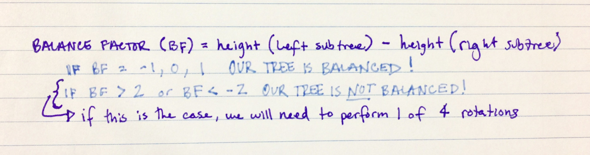
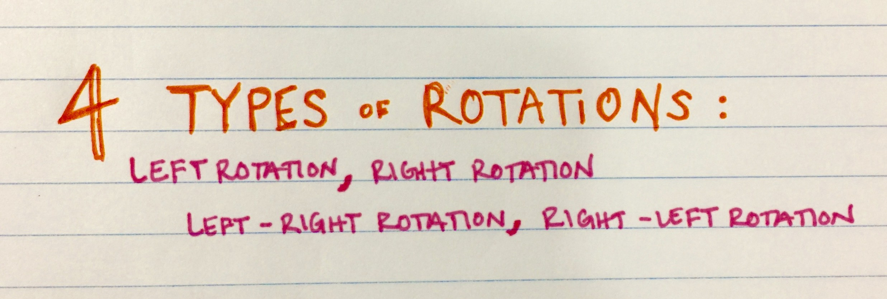
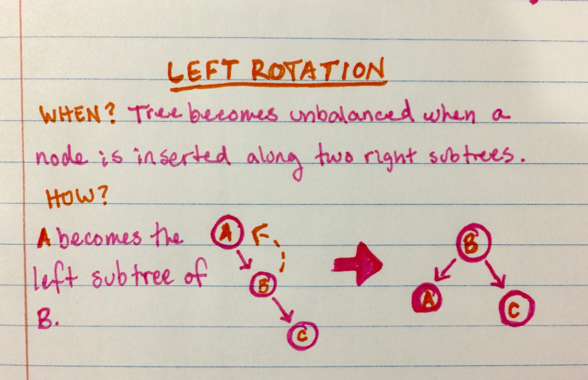
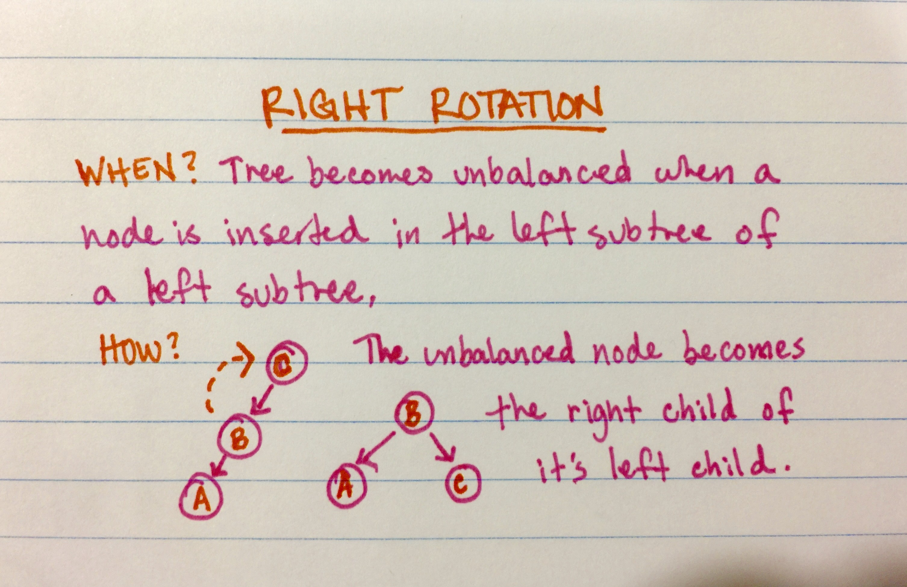
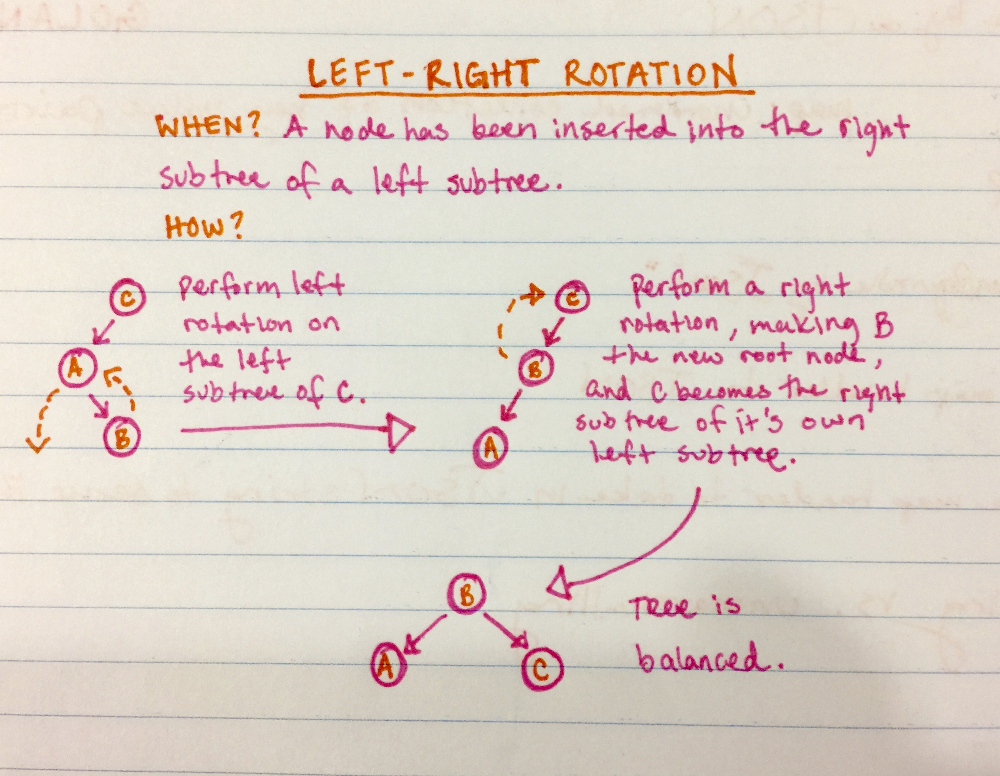
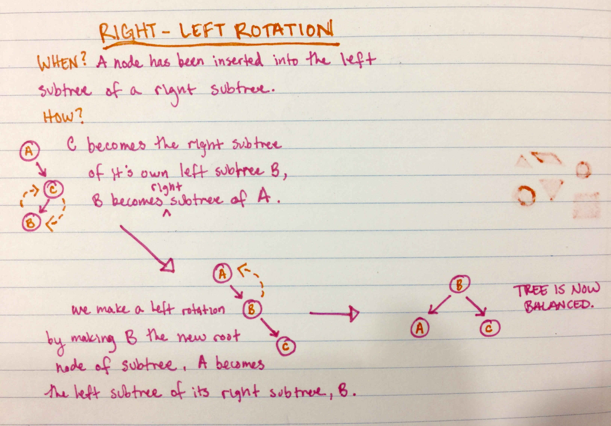

## Implementing an AVL Tree in Python

An AVL Tree is a type of binary search tree (BST) that is able to balance itself. The AVL tree seeks to prevent a BST from its worst-case scenario:

> "In a worst-case scenario, a BST could become unbalanced and function more like a linked list, which is still technically a binary tree, but no longer retains the features that make a BST so popular _[such as time and memory efficiency]_."  
[Taken from our article on AVL Trees, here.](https://medium.com/@betsy.bailey80/avl-trees-for-the-win-69602cae9e18?source=friends_link&sk=55015927c8486c68a9038650ab1e1e54)

**The AVL Tree enforces one major concept: that there can be no major difference between the heights of a tree’s left and right subtrees.** If there is more than a slight difference in the height of two subtrees, the AVL Tree will perform a rotation to restore balance to the tree, and maintain the binary search tree’s efficiency we all know and love. 
[Read more about AVL Trees in our article, here.](https://medium.com/@betsy.bailey80/avl-trees-for-the-win-69602cae9e18?source=friends_link&sk=55015927c8486c68a9038650ab1e1e54)

### Running the Code

We'll be using Python's beloved [__name__ == "__main__"](https://docs.python.org/3/library/__main__.html) to run our code and see it print in our terminal! For this example we've used the names of our classmates as the input. 

  

##### Now, in terminal, run the command `python3 avl_tree.py`.  
##### Once run, terminal should output the list of names in a balanced binary tree! 

 

##### At last, we are able to visualize our working AVL Tree.

#### To see this AVL tree in action yourself, clone into this repository and run `python3 avl_tree.py`.

## Why Use an AVL Tree?
For most simple applications of a binary search tree adding in the functionality of the AVL Tree is usually beneficial. However,since Adelson-Velsky and Landis created the AVL Tree other scholars have created newer and storage trees that have become more popular, like the Red-Black Tree.

The AVL tree is a rockstar when input data stored is already in sorted order. In a traditional BST, a list in sorted order would cause the search tree to operate more like a linked list, invoking the worst-case run time for a binary search tree. Rotating nodes of subtrees to create a balanced tree, as an AVL tree does, remedies this situation entirely.

An AVL Tree would be most useful when the tree is mostly needed for search purposes, and the amount of insertions is limited. The AVL tree will deliver a quick search time, which is desirable in every search tree imaginable.

## Understanding the AVL Tree: Why is It Significant?
Binary search trees are an excellent tool to store and retrieve data when needed. What makes them so excellent is their efficient time and memory performance, however, that efficiency is not always guaranteed.

In a worst-case scenario, a BST could become unbalanced and function more like a linked list, which is still technically a binary tree, but no longer retains the features that make a BST so popular.

If a tree had a method of keeping its subtrees equal in size, it could avoid the worst-case scenario of becoming entirely lopsided, or unbalanced. The AVL Tree enforces one major concept: **that there can be no major difference between the heights of a tree’s left and right subtrees. If there is more than a slight difference in the height of two subtrees, the AVL Tree will perform a rotation to restore balance to the tree,** and maintain the binary search tree’s efficiency we all know and love.

## How do we know if a tree is unbalanced?

We need to be able to determine if we even need a rotation at all. This is where the balance factor comes in. We know binary tree nodes each have a height, which is the number of edges between that node and it’s furthest leaf. Every node in our tree will have a balance factor that calculates the difference in height of each node’s two subtrees. A node’s balance factor is calculated by subtracting the height of its right subtree from the height of it’s left subtree.

***balance factor = right subtree height - left subtree height***

A node’s balance factor will fall into one of two categories: ***balanced or unbalanced.***

A node is ***balanced*** if its balance factor is equal to -1, -0, or 1. When a node is balanced, there is no action needed.

A node is ***unbalanced*** if its balance factor is less than or equal to -2, or greater than or equal to 2. If a node’s balance factor indicates it to be unbalanced we will need to perform one or four rotations.

## Rotations

The AVL Tree performs four types of rotations: ***left rotation*** (single rotation), ***right rotation*** (single rotation), ***left-right rotation*** (double rotation), and ***right-left rotation*** (double rotation.) Each rotation is performed under a specific circumstance resulting in an unbalanced tree. Let’s take a look at the AVL’s four rotations and how they work.

### Left Rotation ←
When a tree becomes unbalanced due to a node being inserted as the right subtree of its right subtree the AVL tree will perform a **left rotation.** Node(A) will become the left child of node(B). This leads to three main changes: node(B) becomes the root of this subtree, node(B)’s left child node is now node(A), and node(A)’s right child now points to nothing (no longer points to node(B)). After this left rotation has been performed this subtree is now balanced!

### Right Rotation →
When a tree becomes unbalanced due to a node being inserted as the left subtree of a left subtree the AVL tree will perform a **right rotation.** This leads to three changes in the subtree’s structure. The unbalanced node (node(C)) will become the right child of node(C)’s current left child. Node(C) will become the right child node of node(B), node(B) becomes the root node of this subtree. Now, node(C)’s left child now points to nothing (no longer points to node(B)). Our subtree is now balanced.

### Left-Right Rotation ← →
This double rotation will be performed when a node has been inserted into the right subtree of a left subtree.

First, the AVL tree will perform a **left rotation** on the left subtree of node(C). Node(C)’s left child becomes node(B), and node(A) becomes the left child of node(B). Additionally, node(A)’s right child now points to nothing (no longer points to node(B)). As you can see, our subtree is still not balanced! Our AVL tree will now perform a **right rotation** to completely balance this subtree. Node(B) is updated to be this subtree’s new root node and node(C) becomes the right child node of node(B) (what was previously node(C)’s left child node.) This means three specific moves are made: node(B) becomes the root node of this subtree, node(B)’s right child now points to node(C), and node(C)’s left child now points to nothing (no longer points to node(B)). After these rotations have been completed, our subtree is now balanced!

### Right-Left Rotation → ←
We have one more rotation to learn, the second double rotation AVL trees can perform. This rotation will be performed when a node has been inserted into the left subtree of a right subtree. As you might be able to infer this **right-left rotation** is very similar to the **left-right rotation**, but reversed.

First, the AVL tree performs a **right roation.** Node(C) will become the right subtree of its own left subtree (node(b)), and node(B) will become the right subtree of node(A). Node(A)’s right child points to node(B), node(B)’s right child now points to node(C), and node(C)’s left child now points to nothing (no longer points to node(B)).

The AVL tree will now perform a left-rotation by making node(B) the new root of this subtree. Node(A) will become the left subtree of its current right subtree, node(B). Specifically, the AVL tree makes three changes: node(B) is the root of this subtree, node(B)’s left child now points to node(A), and node(A)’s right child now points to nothing (no longer points to node(B)).

### Thank you for learning more about AVL Trees. We hope this information is useful to you, and you can find a way to implement the AVL tree to make your own search trees more efficient.